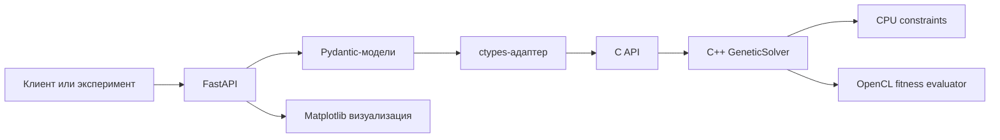
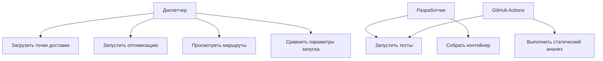
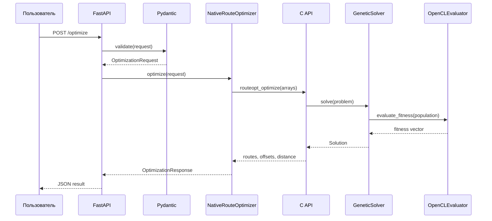
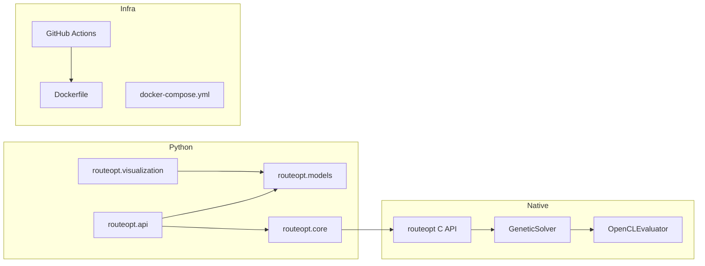
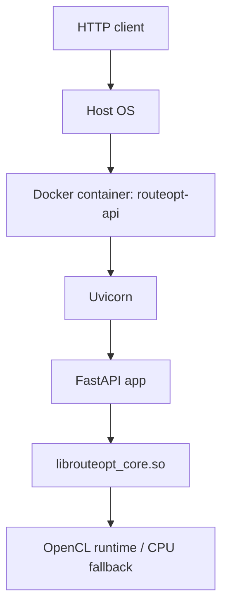

# Курсовая работа

**Тема:** Генетический алгоритм оптимизации маршрутов доставки  
**Дисциплина:** Методы и технологии программирования  
**Вариант:** 22  
**Предметная область:** логистика  
**Технологии:** C++20, Python, OpenCL, Docker, GitHub Actions

## ВВЕДЕНИЕ

Планирование маршрутов доставки относится к числу задач, в которых качество программного решения напрямую влияет на операционные затраты. Для транспортной компании или службы курьерской доставки маршрут не сводится к цепочке точек на карте. Он связан со временем прибытия, грузоподъёмностью автомобиля, количеством рейсов, стоимостью топлива, загрузкой водителя и устойчивостью расписания при изменении заявок. При росте числа клиентов ручное планирование быстро теряет точность: диспетчер может учитывать ближайшие точки и очевидные ограничения, но не способен систематически сравнивать тысячи возможных комбинаций.

Актуальность темы определяется тем, что задача маршрутизации имеет комбинаторную природу. Даже для простой задачи коммивояжёра число возможных маршрутов растёт факториально, а в логистической постановке добавляются ограничения по вместимости автомобиля, длительности рейса и допустимой длине маршрута. Для больших графов полный перебор становится непригодным по времени выполнения, поэтому на практике применяются эвристические и метаэвристические методы. Генетический алгоритм хорошо подходит для такой постановки: он работает с популяцией решений, допускает параллельную оценку приспособленности и может быть адаптирован к ограничениям предметной области.

Цель работы — разработать программную систему оптимизации маршрутов доставки на основе генетического алгоритма с высокопроизводительным C++-ядром, GPU-контуром на OpenCL и Python-интерфейсом для API, экспериментов и визуализации маршрутов.

Для достижения цели определены следующие задачи:

1. Проанализировать предметную область логистики и выделить ограничения, которые должны учитываться при построении маршрутов доставки.
2. Рассмотреть задачу коммивояжёра и связанные с ней подходы к решению маршрутных задач.
3. Сравнить применимые алгоритмы: полный перебор, жадные методы, алгоритм ближайшего соседа, муравьиный алгоритм и генетические алгоритмы.
4. Спроектировать модульную архитектуру системы с разделением на C++-ядро, OpenCL-контур, Python API, визуализацию и инфраструктуру.
5. Реализовать генетический алгоритм с учётом грузоподъёмности, длительности маршрута, длины маршрута и производительности вычислений.
6. Подготовить тесты для C++ и Python-компонентов, сценарии бенчмарков и CI/CD-пайплайн.
7. Описать проектные решения, контейнеризацию, Git Flow, статический анализ и использование AI-assisted development в рамках методических указаний 2026 года.

Объектом исследования является процесс построения маршрутов доставки в логистической системе. Предметом исследования является программная реализация генетического алгоритма для приближённого решения задачи маршрутизации на графе с ограничениями.

Практическая значимость работы состоит в создании воспроизводимого программного проекта, который можно использовать как основу для экспериментального сравнения маршрутных алгоритмов. Проект содержит не только алгоритмическую часть, но и прикладной интерфейс, контейнеризацию, автоматическую проверку качества и документацию. Такой состав соответствует современному циклу разработки программного продукта: постановка задачи, архитектура, реализация, тестирование, сборка, запуск и анализ результата.

## ГЛАВА 1. АНАЛИТИЧЕСКАЯ ЧАСТЬ

### 1.1 Анализ предметной области логистики и маршрутизации

Логистика доставки охватывает планирование перемещения грузов от склада, распределительного центра или магазина до конечных клиентов. В программной системе такая предметная область обычно описывается набором сущностей: депо, клиент, заказ, транспортное средство, маршрут, рейс, расписание и ограничение. Депо является начальной и конечной точкой маршрута. Клиент задаёт координаты, объём или массу заказа, допустимый интервал доставки и сервисное время. Транспортное средство имеет грузоподъёмность, допустимую длительность работы и стоимость эксплуатации.

Маршрутизация в логистике отличается от абстрактной задачи на графе тем, что решение должно быть применимым в операционном процессе. Короткий по расстоянию маршрут может оказаться непригодным из-за превышения грузоподъёмности, нарушения времени доставки или слишком длинной смены водителя. По этой причине критерий качества обычно включает несколько компонентов: суммарное расстояние, количество рейсов, штрафы за нарушения ограничений, равномерность загрузки автомобилей и устойчивость к добавлению новых заказов.

В рамках курсовой работы используется упрощённая, но инженерно полезная модель. Каждый клиент имеет координаты в пределах площадки `100 x 100 км` и величину спроса. Депо задаёт начало и конец каждого рейса. Автомобиль описывается грузоподъёмностью, средней скоростью и максимальной длительностью маршрута. Расстояние между точками рассчитывается как евклидово в километрах, а время пути определяется делением расстояния на среднюю скорость с добавлением времени обслуживания клиентов. При дальнейшем развитии проекта этот слой можно заменить дорожной матрицей расстояний, полученной из картографического сервиса или внутренней геоинформационной системы.

### 1.2 Проблема оптимизации маршрутов доставки

Основная сложность оптимизации маршрутов связана с сочетанием дискретного выбора порядка посещения клиентов и непрерывной оценки стоимости. Если клиентов десять, число возможных перестановок уже достигает миллионов. При сотнях клиентов простой перебор теряет практический смысл. Ограничения по грузоподъёмности и времени доставки дополнительно усложняют задачу: требуется не только упорядочить клиентов, но и разбить их на допустимые рейсы.

В реальной системе оптимизатор должен работать в условиях ограниченного времени. Диспетчер не может ждать часы, пока алгоритм переберёт все маршруты. Нужен метод, который быстро выдаёт допустимое решение и улучшает его при наличии дополнительного времени. Такое свойство особенно важно для интерактивного интерфейса, где пользователь может изменять параметры автомобиля, добавлять заказы и повторно запускать расчёт.

В данной работе задача формулируется как поиск набора маршрутов, начинающихся и завершающихся в депо. Каждый клиент должен быть посещён ровно один раз. Суммарный спрос клиентов в одном рейсе не должен превышать грузоподъёмность автомобиля. Длительность рейса, включающая путь и сервисное время, не должна превышать заданный предел. Целевая функция минимизирует суммарное расстояние и добавляет штрафы за нарушения ограничений.

### 1.3 Обзор задачи коммивояжёра

Задача коммивояжёра описывает поиск кратчайшего гамильтонова цикла в полном взвешенном графе. Вершины графа соответствуют городам или точкам доставки, а веса рёбер задают расстояния либо стоимость перемещения. Требуется построить маршрут, который проходит через каждую вершину один раз и возвращается в начальную точку.

Классическая TSP-постановка полезна для анализа, поскольку она задаёт базовую комбинаторную структуру маршрута: порядок посещения вершин. Логистическая задача доставки расширяет эту структуру. В ней появляется несколько рейсов, ограничение вместимости и ограничения по времени. Такое расширение обычно относят к vehicle routing problem. В работе используется представление, при котором хромосома генетического алгоритма является перестановкой клиентов, а процедура декодирования превращает перестановку в набор рейсов. Такой подход сохраняет связь с TSP и позволяет учитывать ограничения предметной области без усложнения генетических операторов.

Для больших графов TSP и VRP считаются вычислительно сложными задачами. Оптимальное решение можно найти точными методами для ограниченного числа вершин, однако для учебной системы, ориентированной на большие графы и сравнение CPU/GPU-контуров, более уместен приближённый метод. Он должен давать приемлемое решение за предсказуемое время и позволять масштабировать оценку популяции.

### 1.4 Анализ существующих алгоритмов

Полный перебор рассматривает все возможные перестановки клиентов. Его преимущество состоит в гарантии оптимального решения, но практическая область применения крайне мала. При росте числа точек факториальная сложность делает перебор непригодным даже для умеренных входных данных. В курсовом проекте полный перебор может использоваться только как теоретическая точка отсчёта или как проверка малых тестовых наборов.

Жадные алгоритмы строят маршрут через последовательный выбор локально лучшего действия. Обычно выбирается ближайшая точка, минимальная вставка или минимальное увеличение стоимости. Такие методы просты, быстро работают и дают допустимое начальное решение. Их недостаток связан с локальностью выбора: раннее решение может ухудшить весь маршрут, а алгоритм не возвращается к пересмотру уже принятых шагов.

Алгоритм ближайшего соседа является частным случаем жадного подхода. Он начинает маршрут в депо и на каждом шаге выбирает ближайшего ещё не посещённого клиента. Метод удобен для получения базовой оценки качества, но чувствителен к расположению точек. В кластерах он часто работает приемлемо, а при наличии удалённых точек может оставлять неудобные вершины на конец маршрута, увеличивая суммарное расстояние.

Муравьиный алгоритм моделирует поведение колонии агентов, которые строят маршруты и изменяют вероятности выбора рёбер через феромонную матрицу. Его преимущество состоит в способности комбинировать локальную информацию о расстояниях и накопленный опыт поиска. Недостатки связаны с большим числом параметров, расходом памяти на феромоны и необходимостью аккуратной настройки испарения, влияния расстояния и вероятностного выбора.

Генетические алгоритмы работают с популяцией решений. Каждая особь кодирует порядок посещения клиентов. На каждом поколении вычисляется приспособленность, выбираются родители, выполняются кроссовер и мутация. Метод устойчив к локальным минимумам, допускает параллельную оценку особей и хорошо подходит для гибридизации с локальным поиском. Для данной работы генетический алгоритм выбран из-за естественного соответствия задаче перестановочной оптимизации и возможности вынести массовые расчёты расстояний в OpenCL kernel.

| Алгоритм | Преимущества | Ограничения | Роль в проекте |
|---|---|---|---|
| Полный перебор | Оптимальность на малых данных | Факториальная сложность | Теоретический ориентир |
| Жадный метод | Простота, высокая скорость | Локальные ошибки выбора | Базовая эвристика |
| Ближайший сосед | Минимальная сложность реализации | Нестабильное качество | Сравнение качества |
| Муравьиный алгоритм | Вероятностный поиск, память рёбер | Сложная настройка параметров | Альтернативная метаэвристика |
| Генетический алгоритм | Популяционный поиск, параллельность | Нет гарантии оптимума | Основной метод |

### 1.5 Анализ существующих решений и сервисов

На рынке существуют сервисы маршрутизации для доставки, курьерских служб и транспортной логистики. К таким решениям относятся облачные оптимизаторы маршрутов, модули в транспортных системах управления и API геосервисов. Они обычно предоставляют расчёт маршрута по дорожной сети, учёт временных окон, назначение заказов автомобилям и интеграцию с мобильным приложением водителя. Сильная сторона таких систем состоит в готовой инфраструктуре и доступе к картографическим данным.

Для учебного проекта важна другая задача: показать внутреннее устройство оптимизатора, структуру данных, критерии качества, тестирование и производительность. Готовые сервисы скрывают алгоритмическое ядро, не дают изучить влияние параметров генетического алгоритма и не позволяют свободно менять вычислительный backend. Разрабатываемая система ориентирована на исследовательский и инженерный сценарий: входные данные контролируются, алгоритм доступен для модификации, результаты можно измерять через бенчмарки.

При сравнении с промышленными решениями следует учитывать масштаб ответственности. Курсовой проект не претендует на замену картографической платформы или TMS-системы. Он реализует ядро оптимизации и демонстрирует подход к построению production-like архитектуры: строгие модели данных, нативное вычислительное ядро, API, контейнеризация, CI/CD, тестирование и документация.

## ГЛАВА 2. ПРОЕКТНАЯ ЧАСТЬ

### 2.1 Архитектура системы

Архитектура системы построена по модульному принципу. Вычислительная часть вынесена в C++-библиотеку `routeopt_core`, поскольку именно она выполняет наиболее затратные операции: декодирование хромосом, расчёт расстояний, оценку штрафов и эволюционные шаги. Python-слой отвечает за прикладные функции: проверку входных данных, HTTP API, вызов нативной библиотеки, визуализацию маршрутов и запуск экспериментов.

Граница между C++ и Python реализована через C ABI. Такой вариант выбран для устойчивости интеграции: Python вызывает нативную библиотеку через `ctypes`, а C++-код не зависит от версии CPython. В промышленном проекте возможна замена на pybind11, но для курсовой работы C ABI проще проверять в контейнере и CI.

Инфраструктурный слой включает Docker, Docker Compose и GitHub Actions. Docker фиксирует системные зависимости: компилятор, CMake и OpenCL headers. GitHub Actions выполняет сборку, тесты и статическую проверку. Проектная структура не смешивает алгоритм, API, тесты и документацию, что упрощает сопровождение.

### 2.2 Общая схема взаимодействия компонентов

Пользователь или экспериментальный скрипт отправляет запрос в FastAPI-приложение. Pydantic-модели проверяют структуру входных данных: уникальность идентификаторов, положительную грузоподъёмность, допустимые значения параметров генетического алгоритма. После проверки Python-адаптер преобразует данные в плотные массивы `numpy` и передаёт указатели в C API.

C++-ядро выполняет оптимизацию и возвращает компактное представление маршрутов: массив индексов клиентов и массив смещений маршрутов. Python-слой преобразует эти индексы обратно в пользовательские идентификаторы, формирует JSON-ответ и при необходимости строит изображение маршрутов. Такой поток данных минимизирует сериализацию между языками и сохраняет понятный контракт API.



### 2.3 Архитектура C++ ядра

C++-ядро содержит доменные структуры `Customer`, `Problem`, `Route`, `Solution` и `SolverConfig`. `Problem` описывает входную задачу: узлы графа, индекс депо, грузоподъёмность автомобиля и максимальное время маршрута. `Solution` хранит найденные маршруты, суммарное расстояние, штрафы, признак допустимости и имя вычислительного backend.

Класс `GeneticSolver` инкапсулирует генетический алгоритм. Метод `solve` создаёт начальную популяцию, запускает поколения, оценивает приспособленность, применяет селекцию, ordered crossover и мутацию. Метод `decode` отделён от `solve`, поскольку он нужен и для оценки особи, и для тестирования корректности ограничений. Такой дизайн упрощает проверку: можно отдельно подать хромосому и убедиться, что она корректно разбивается на маршруты.

Класс `OpenCLEvaluator` отвечает за пакетную оценку функции приспособленности хромосом. Он изолирует работу с OpenCL context, device, command queue, buffers и kernel. Если OpenCL-платформа отсутствует, C++-ядро сохраняет работоспособность на CPU. При доступной OpenCL-платформе расстояние, разбиение на рейсы и штрафы за ограничения рассчитываются через kernel `route_fitness_kernel`.

### 2.4 Использование OpenCL для GPU-ускорения

Оценка популяции является одной из наиболее удобных частей генетического алгоритма для параллельного исполнения. Каждая хромосома может оцениваться независимо от остальных, поэтому пакет особей естественно отображается на сетку OpenCL work-items. В проекте каждый work-item проходит по одной хромосоме, формирует рейсы с учётом грузоподъёмности и предела времени, рассчитывает расстояние и добавляет штраф при недопустимом одиночном заказе.

CPU-код остаётся ответственным за построение возвращаемого объекта `Solution`, поэтому API получает подробный набор маршрутов и метрик. OpenCL вычисляет стоимость особей при отборе популяции, то есть переносит наиболее многократно выполняемую часть поиска. При дальнейшем развитии стоимость передачи буферов можно снизить за счёт повторного использования OpenCL context и предварительно вычисленной матрицы расстояний.

OpenCL выбран вместо CUDA из-за переносимости. CUDA привязана к GPU NVIDIA, а OpenCL может работать на разных устройствах: дискретных GPU, встроенных GPU и некоторых CPU runtime. Для учебного проекта переносимость важнее максимальной производительности на конкретном оборудовании.

### 2.5 Архитектура Python-интерфейса

Python-интерфейс состоит из четырёх частей. Первая часть — модели данных `Customer`, `Vehicle`, `SolverSettings`, `OptimizationRequest` и `OptimizationResponse`. Они описывают контракт API и предотвращают попадание некорректных данных в C++-ядро. Вторая часть — класс `NativeRouteOptimizer`, который ищет нативную библиотеку, настраивает сигнатуры `ctypes` и выполняет преобразование данных. Третья часть — FastAPI-приложение с маршрутами `/health` и `/optimize`. Четвёртая часть — русскоязычный браузерный интерфейс, обслуживаемый тем же FastAPI-приложением по корневому адресу.

Веб-интерфейс предоставляет форму исходных данных, таблицу точек доставки, параметры автомобиля, переключатель запроса OpenCL и карту маршрутов на `canvas`. Координаты ограничены размерами отображаемой зоны, длина выводится в километрах, время — в часах. Результат преобразуется в понятные показатели: число рейсов, суммарная длина, суммарное время, соблюдение ограничений и режим вычисления. Технический JSON сохранён в раскрываемом блоке для проверки контракта API, но не используется как основное представление результата.

Модуль `visualization.py` сохранён для пакетных экспериментов и подготовки изображений в отчёт. Он не участвует в HTTP-обработке и может использоваться независимо. Такое разделение снижает связанность: веб-экран подходит для интерактивной демонстрации, а Matplotlib-модуль — для воспроизводимой генерации иллюстраций.

Python fallback используется только как режим разработки и тестирования API без нативной библиотеки. В итоговом варианте расчёт должен выполняться C++-ядром. Наличие fallback повышает удобство разработки, но в документации и бенчмарках отдельно указано, какой backend применялся.

### 2.6 Описание базы данных и структур данных

В текущей версии постоянная база данных не используется. Причина связана с границами курсовой работы: основной предмет разработки — алгоритм оптимизации, OpenCL-контур, API и анализ производительности. Хранение пользователей, заказов и истории маршрутов можно добавить на следующем этапе через PostgreSQL, но включение базы данных в первую версию увеличило бы объём инфраструктуры без прямого влияния на алгоритмическую часть.

Вместо базы данных используется явная модель структур данных. Входной запрос содержит депо, список клиентов, параметры автомобиля и настройки алгоритма. В C++ эти данные преобразуются в плотные структуры и массивы. Такое представление экономит память, удобно для передачи через C ABI и подходит для последующего GPU-исполнения.

| Структура | Поля | Назначение |
|---|---|---|
| `Customer` | `x`, `y`, `demand`, `service_time` | Узел графа и параметры заказа |
| `Problem` | `nodes`, `depot_index`, `vehicle_capacity`, `max_route_time`, `average_speed_kmh` | Полное описание задачи |
| `Route` | `nodes`, `load`, `duration`, `distance` | Один рейс автомобиля |
| `Solution` | `routes`, `total_distance`, `penalty`, `feasible`, `backend` | Результат оптимизации |
| `SolverConfig` | `population_size`, `generations`, `mutation_rate`, `seed`, `prefer_gpu` | Параметры генетического алгоритма |

### 2.7 UML-диаграммы

Use Case-диаграмма показывает основные действия пользователя и CI-системы.



Sequence-диаграмма описывает обработку запроса оптимизации.



Component-диаграмма фиксирует границы модулей.



Deployment-диаграмма отражает запуск в контейнере.



### 2.8 Алгоритм работы генетического алгоритма

Начальная популяция создаётся из перестановок клиентов. Базовая хромосома содержит все индексы клиентов без депо, после чего для большинства особей выполняется случайное перемешивание. Размер популяции задаётся параметром `population_size`. Увеличение популяции повышает разнообразие, но увеличивает время оценки каждого поколения.

Функция приспособленности включает расстояние и штрафы. В CPU-режиме она определяется через декодирование хромосомы в набор рейсов. Если выбран OpenCL backend и платформа доступна, kernel пакетно рассчитывает ту же стоимость: открывает новый рейс при превышении вместимости или времени и назначает большой штраф заказу, который не может быть обслужен отдельным рейсом. Штраф применяется при превышении грузоподъёмности или нарушении максимального времени маршрута.

Селекция реализована через турнирный отбор. Из популяции случайно выбирается несколько кандидатов, после чего родителем становится особь с меньшей стоимостью. Такой метод проще рулеточной селекции и устойчивее при больших различиях значений приспособленности.

Кроссовер выполнен как ordered crossover. Для перестановочных задач обычный одноточечный кроссовер может создавать дубликаты клиентов и терять вершины. Ordered crossover копирует фрагмент одного родителя и дополняет ребёнка порядком генов второго родителя, сохраняя корректную перестановку.

Мутация меняет местами две случайные позиции в хромосоме. Вероятность мутации задаётся параметром `mutation_rate`. Такой оператор мал по стоимости и хорошо подходит для перестановок. Критерий остановки в текущей версии — фиксированное число поколений. В дальнейшем можно добавить раннюю остановку при отсутствии улучшения за заданное число поколений.

## ГЛАВА 3. ТЕХНОЛОГИЧЕСКАЯ ЧАСТЬ

### 3.1 Обоснование выбора C++

C++ выбран для алгоритмического ядра из-за требований к производительности и управлению памятью. Генетический алгоритм многократно обрабатывает массивы хромосом и выполняет большое число операций над числовыми данными. В таком сценарии стоимость интерпретации и динамической диспетчеризации может стать заметной. C++ позволяет использовать плотные структуры, контролировать копирование, компилировать код с оптимизациями и отделять вычислительную библиотеку от прикладного интерфейса.

В проекте используется стандарт C++20. Его возможностей достаточно для реализации структур данных, генератора случайных чисел, алгоритмов стандартной библиотеки и безопасного интерфейса. Проект не вводит тяжёлые внешние зависимости в ядро, поскольку для курсовой работы важны воспроизводимость и понятность сборки.

### 3.2 Обоснование выбора Python

Python используется как язык прикладной интеграции. Он удобен для описания API, подготовки экспериментов, быстрой генерации сценариев и построения графиков. FastAPI даёт строгий HTTP-интерфейс и автоматическую OpenAPI-документацию, Pydantic проверяет входные данные, `numpy` обеспечивает компактное представление массивов для передачи в C API.

Разделение C++ и Python позволяет совместить производительность и скорость разработки. C++ отвечает за расчёт, Python — за пользовательский и исследовательский слой. Такой подход часто применяется в системах научных вычислений и машинного обучения, где нативные библиотеки вызываются из Python-интерфейса.

### 3.3 Причины использования OpenCL

OpenCL применяется для ускорения массовой оценки функции приспособленности. Генетический алгоритм обрабатывает популяцию, а каждая особь может оцениваться независимо. Такая структура хорошо соответствует модели OpenCL: host-код подготавливает координаты, спрос, сервисное время и хромосомы, kernel выполняется параллельно для множества work-items, результат возвращается в host-память.

Выбор OpenCL связан с переносимостью. Проект не должен зависеть от конкретного производителя GPU. OpenCL позволяет запускать один и тот же подход на разных устройствах при наличии runtime. В учебной среде это важно, поскольку оборудование у разработчика, проверяющего и CI может отличаться.

### 3.4 Использование Docker и Docker Compose

Dockerfile описывает воспроизводимую среду сборки и запуска. В контейнер устанавливаются `build-essential`, `cmake` и `ocl-icd-opencl-dev`, затем выполняется CMake-сборка C++-ядра и установка Python-зависимостей. Приложение запускается через Uvicorn и предоставляет API на порту 8000.

Docker Compose упрощает локальный запуск. Вместо ручной настройки переменных окружения и путей к библиотеке используется сервис `api`, в котором уже задан `ROUTEOPT_LIB` и `PYTHONPATH`. Такой подход снижает вероятность ошибок при демонстрации проекта.

### 3.5 Git Flow и организация репозитория

Репозиторий организован по функциональным зонам: `cpp/`, `python/`, `benchmarks/`, `docs/`, `scripts/`, `.github/`. Такая структура делает границы ответственности явными. Алгоритмический код не смешивается с API, тесты расположены рядом с соответствующим стеком, а материалы курсовой находятся в `docs/course-paper`.

Для работы над проектом используется упрощённый Git Flow. Ветка `master` хранит стабильное состояние. Функциональные изменения могут выполняться в ветках вида `feature/core-ga`, `feature/python-api`, `feature/opencl-evaluator`, документы — в ветке `docs/course-paper`. Коммиты оформляются в стиле Conventional Commits: `feat:`, `fix:`, `test:`, `build:`, `ci:`, `docs:`. В текущем репозитории уже выполнены семантические коммиты по ядру, Python-слою, инфраструктуре и документации.

### 3.6 CI/CD и GitHub Actions

GitHub Actions выполняет автоматическую проверку при push и pull request. Pipeline устанавливает системные зависимости, собирает C++-код через CMake, запускает CTest, устанавливает Python-зависимости, выполняет pytest и Ruff. Такой набор проверок закрывает основные риски: ошибки компиляции, регрессии алгоритма, нарушение API-контракта и проблемы стиля Python-кода.

CI/CD в курсовом проекте нужен не только для формального соответствия методическим указаниям. Он фиксирует воспроизводимость результата. Если проект собирается в чистой Linux-среде, его проще перенести на сервер, показать преподавателю или развернуть в контейнере.

### 3.7 Тестирование

Unit-тесты C++ проверяют ядро алгоритма на малой задаче. Тест создаёт депо и несколько клиентов, запускает solver и проверяет, что все клиенты посещены, решение допустимо, а загрузка каждого маршрута не превышает вместимость. Такой тест не доказывает оптимальность, но защищает базовую корректность декодирования и ограничений.

Python unit-тесты проверяют модели данных: уникальность идентификаторов и положительную грузоподъёмность. Интеграционные тесты через FastAPI TestClient проверяют `/health` и `/optimize`. Нагрузочный сценарий вынесен в бенчмарк: он запускает CLI на заданном числе клиентов и поколений, измеряет время и сохраняет JSON-отчёт.

Разделение тестов по уровням важно для сопровождения. Ошибку в генетическом операторе проще поймать в C++-тесте, ошибку валидации — в Python unit-тесте, проблему HTTP-контракта — в интеграционном тесте API.

### 3.8 Безопасность и статический анализ кода

Безопасность разработки рассматривается на нескольких уровнях. На уровне API входные данные проходят проверку Pydantic: отрицательная вместимость, пустой список клиентов и повторяющиеся идентификаторы отклоняются до вызова C++-ядра. На границе C API проверяются указатели, размеры массивов и коды ошибок. На уровне CI используется Ruff для статической проверки Python-кода.

Для развития проекта можно добавить `clang-tidy` и `cppcheck` для C++-части, Dependabot для контроля зависимостей, Trivy для анализа контейнерного образа и CodeQL для статического анализа в GitHub Actions. Эти инструменты согласуются с методическими указаниями 2026 года, где отдельно указаны SAST-анализ и проверка зависимостей.

AI-assisted development применялся как вспомогательный процесс: генерация вариантов структуры, редактура академического текста, проверка повторов, подготовка тестовых сценариев и уточнение инженерных решений. Ответственность за архитектуру, согласованность требований и итоговую проверку остаётся на разработчике. Такой формат соответствует современному использованию AI-инструментов в разработке: ассистент ускоряет рутинную работу, но не заменяет инженерную валидацию.

## ГЛАВА 4. РЕАЛИЗАЦИЯ ПРОЕКТА

### 4.1 Структура проекта

Проект размещён в каталоге `C:\Users\Денис\Documents\mitp\coursework`. Основные файлы и каталоги:

```text
cpp/
  include/routeopt/       публичные заголовки C++-ядра
  src/                    реализация solver, C API и OpenCL evaluator
  tests/                  C++ unit-тесты
  kernels/                OpenCL kernel
python/routeopt/          Python API, модели, ctypes-интеграция и веб-интерфейс
python/tests/             pytest-тесты
benchmarks/               сценарий сравнения CPU и GPU
docs/course-paper/        пояснительная записка
docs/diagrams/            диаграммы архитектуры
scripts/                  генерация экспериментальных сценариев
.github/workflows/        CI pipeline
```

Такая структура согласуется с production-like подходом: вычислительная библиотека, API, тесты, инфраструктура и документация имеют отдельные области. Это упрощает навигацию и снижает риск случайной связи между независимыми слоями.

### 4.2 Реализация ядра алгоритма

C++-ядро реализовано в классе `GeneticSolver`. Конфигурация алгоритма передаётся через `SolverConfig`: размер популяции, число поколений, доля элиты, вероятность мутации, seed и признак предпочтения GPU. Seed делает эксперименты воспроизводимыми, что важно для сравнения параметров.

Декодирование хромосомы выполняет преобразование перестановки клиентов в набор рейсов. Алгоритм идёт по хромосоме слева направо, накапливает текущую загрузку и длительность маршрута. Если добавление клиента нарушает ограничение, текущий маршрут закрывается, а клиент добавляется в новый рейс. После построения маршрутов рассчитывается суммарное расстояние и штрафы.

Фрагмент реализации ordered crossover:

```cpp
std::vector<std::size_t> GeneticSolver::ordered_crossover(
    const std::vector<std::size_t>& a,
    const std::vector<std::size_t>& b) {
    if (a.size() < 2) {
        return a;
    }
    std::uniform_int_distribution<std::size_t> pick(0, a.size() - 1);
    auto left = pick(rng_);
    auto right = pick(rng_);
    if (left > right) {
        std::swap(left, right);
    }

    std::vector<std::size_t> child(a.size(), std::numeric_limits<std::size_t>::max());
    std::unordered_set<std::size_t> used;
    for (std::size_t i = left; i <= right; ++i) {
        child[i] = a[i];
        used.insert(a[i]);
    }
    ...
}
```

Код сохраняет корректность перестановки: каждый клиент встречается один раз, а депо не включается в хромосому. Это снижает объём исправления недопустимых особей после кроссовера.

### 4.3 Реализация GPU-ускорения

GPU-контур представлен классом `OpenCLEvaluator` и kernel `route_fitness_kernel`. Host-код выбирает OpenCL-платформу и устройство, создаёт context, command queue, program, kernel и буферы. В буферы передаются координаты, спрос, сервисное время и плоский массив хромосом. Каждый work-item рассчитывает стоимость одной особи с учётом разбиения на рейсы.

Фрагмент OpenCL kernel:

```c
__kernel void route_fitness_kernel(
    __global const double2* points,
    __global const int* chromosomes,
    __global double* fitness,
    const int chromosome_size,
    const int depot_index) {
    const int gid = get_global_id(0);
    const int offset = gid * chromosome_size;
    double distance = 0.0;
    int prev = depot_index;

    for (int i = 0; i < chromosome_size; ++i) {
        const int node = chromosomes[offset + i];
        const double dx = points[prev].x - points[node].x;
        const double dy = points[prev].y - points[node].y;
        distance += sqrt(dx * dx + dy * dy);
        prev = node;
    }
    ...
}
```

В текущей архитектуре OpenCL ускоряет оценку функции качества в ходе эволюционного поиска, включая штрафы за вместимость и время. CPU после выбора лучшей хромосомы формирует подробный объект ответа для API. При наличии OpenCL runtime Python-слой сообщает backend `native-opencl-fitness`; при отсутствии runtime используется C++ CPU-режим `native-cpu-opencl-unavailable`.

### 4.4 Реализация Python API

Python API реализован в `python/routeopt/api.py`. Приложение содержит endpoint `/health` для проверки состояния и `/optimize` для запуска оптимизации, а корневой маршрут возвращает страницу пользовательского интерфейса. Модели Pydantic задают контракт запроса и ответа. Проверка уникальности идентификаторов клиентов вынесена в `model_validator`, чтобы ошибка обнаруживалась до передачи данных в нативный слой.

Фрагмент API:

```python
app = FastAPI(title="RouteOpt API", version="0.1.0")
optimizer = NativeRouteOptimizer()

@app.get("/health")
def health() -> dict[str, str]:
    return {"status": "ok", "native_library": "loaded" if optimizer.library_path else "not-found"}

@app.post("/optimize", response_model=OptimizationResponse)
def optimize(request: OptimizationRequest) -> OptimizationResponse:
    return optimizer.optimize(request)
```

Нативная библиотека обнаруживается через переменную окружения `ROUTEOPT_LIB` или стандартные пути сборки. Если библиотека отсутствует, используется Python fallback, чтобы API и интерфейс можно было запускать до компиляции C++-части. Fallback рассчитывает расстояние и время каждого рейса, учитывает вместимость и максимальную длительность, но в отчётах производительности не используется как основной режим.

### 4.5 Визуализация маршрутов

Основная интерактивная визуализация реализована на странице `python/routeopt/static/index.html`. Экран разделён на три рабочие области: исходные данные, координатная карта и результат. Пользователь редактирует точки доставки без ручной работы с JSON, запускает оптимизацию и видит линии каждого рейса отдельным цветом. Для каждого маршрута выводятся порядок посещения клиентов, расстояние в километрах, время в часах и заполнение грузоподъёмности. Краткие объяснения открываются около кнопок справки в секциях настроек, поэтому область результатов полностью отводится найденным рейсам.

Параметры алгоритма сопровождаются краткими пояснениями на русском языке: популяция описана как число сравниваемых вариантов маршрута, поколения — как число циклов улучшения, OpenCL — как запрашиваемый режим ускорения. Рядом с итогом указывается фактический backend, поэтому демонстрационный Python-режим нельзя спутать с расчётом C++ или GPU.

Модуль `visualization.py` дополнительно строит статическое изображение через Matplotlib. Он применяется в экспериментах и при подготовке иллюстраций для пояснительной записки, тогда как браузерный интерфейс предназначен для защиты и интерактивной проверки.

### 4.6 Примеры кода

Пример запроса к API:

```json
{
  "depot": {"id": 0, "x": 50, "y": 50, "demand": 0},
  "customers": [
    {"id": 1, "x": 12, "y": 20, "demand": 4},
    {"id": 2, "x": 70, "y": 65, "demand": 6},
    {"id": 3, "x": 25, "y": 80, "demand": 3}
  ],
  "vehicle": {"capacity": 10, "max_route_time": 4, "average_speed_kmh": 45},
  "settings": {"population_size": 96, "generations": 250, "seed": 42, "prefer_gpu": true}
}
```

Пример ответа:

```json
{
  "routes": [
    {"customer_ids": [1, 3], "load": 7},
    {"customer_ids": [2], "load": 6}
  ],
  "total_distance": 184.52,
  "total_duration": 4.44,
  "feasible": true,
  "backend": "native-opencl-fitness"
}
```

Пример запуска бенчмарка:

```bash
cmake -S . -B build -DCMAKE_BUILD_TYPE=Release
cmake --build build -j 2
python benchmarks/benchmark_cpu_gpu.py --cli build/routeopt_cli --customers 250 --generations 300
```

### 4.7 Примеры работы программы

Для генерации входного сценария используется скрипт:

```bash
python scripts/generate_scenario.py --customers 100 --seed 42 --output data/scenario.json
```

После запуска API пользователь может отправить JSON-запрос на `/optimize` и получить список маршрутов. Для демонстрации можно построить изображение через `render_routes`, передав исходный запрос, ответ оптимизатора и путь к PNG-файлу. В ходе защиты такая визуализация удобна: она показывает не только числовой результат, но и пространственное распределение рейсов.

### 4.8 Описание контейнеризации

Контейнеризация описана в `Dockerfile`. На этапе сборки устанавливаются системные зависимости, копируется проект, выполняется CMake-сборка, затем устанавливаются Python-зависимости. Приложение запускается командой:

```bash
uvicorn routeopt.api:app --host 0.0.0.0 --port 8000
```

Файл `docker-compose.yml` задаёт сервис `api`, проброс порта `8000:8000` и переменные окружения. Такой способ запуска удобен для демонстрации и проверки, поскольку пользователь не настраивает компилятор и пути вручную.

## ГЛАВА 5. ТЕСТИРОВАНИЕ И АНАЛИЗ РЕЗУЛЬТАТОВ

### 5.1 Сценарии тестирования

Тестирование организовано по уровням. На уровне C++ проверяется корректность ядра: создаётся небольшая задача, solver строит решение, тест проверяет посещение всех клиентов и соблюдение грузоподъёмности. На уровне Python проверяются модели данных и API. Интеграционный тест `/optimize` подтверждает, что JSON-запрос проходит валидацию и возвращает допустимый ответ.

Отдельный сценарий предназначен для производительности. Скрипт `benchmark_cpu_gpu.py` запускает CLI в режимах CPU и GPU, измеряет время выполнения и сохраняет результаты в `benchmarks/results.json`. Параметры числа клиентов и поколений задаются из командной строки, что позволяет строить серию экспериментов.

### 5.2 Производительность алгоритма

Время работы генетического алгоритма зависит от размера популяции, числа поколений и числа клиентов. При фиксированном числе поколений увеличение популяции повышает стоимость одного поколения почти линейно. Увеличение числа клиентов влияет на стоимость декодирования и расчёта расстояний, поскольку каждая хромосома содержит больше генов.

Производительность можно улучшать несколькими способами: пакетной оценкой функции качества на GPU, уменьшением лишних копирований, хранением матрицы расстояний, ранней остановкой при стабилизации результата, гибридизацией с локальным поиском только для лучших особей. В текущей версии основной упор сделан на понятную архитектуру и воспроизводимые бенчмарки.

### 5.3 Сравнение CPU и GPU

CPU-контур выполняет полный расчёт: декодирование, расстояния, штрафы и генетические операторы. GPU-контур переносит оценку функции качества популяции в OpenCL kernel. Эффект от GPU зависит от размера популяции и числа клиентов. На малых входных данных накладные расходы на создание OpenCL context, компиляцию kernel и передачу буферов могут быть выше выигрыша. На больших входных данных параллельная оценка особей становится полезнее.

Бенчмарк фиксирует два значения: `requested_backend` и `backend`. Первое показывает режим, выбранный пользователем, второе — фактический backend, доступный на машине. Это важно для корректной интерпретации результатов: если OpenCL runtime отсутствует, запуск с `--backend gpu` не должен ошибочно считаться GPU-ускорением.

### 5.4 Анализ качества маршрутов

Качество маршрута оценивается по суммарному расстоянию, числу рейсов, допустимости ограничений и распределению нагрузки. Допустимое решение, нарушающее грузоподъёмность, не может использоваться в логистике, даже если его расстояние мало. По этой причине в функции приспособленности штраф за нарушение ограничений имеет большую величину.

Визуальный анализ дополняет числовые метрики. На карте можно увидеть пересечения маршрутов, неудачное смешение удалённых кластеров и слишком длинные рейсы. Такой анализ особенно полезен при подборе параметров генетического алгоритма: размер популяции, вероятность мутации и число поколений меняют не только итоговое расстояние, но и форму маршрутов.

### 5.5 Сравнение с классическими алгоритмами

По сравнению с ближайшим соседом генетический алгоритм требует больше времени, но способен пересматривать порядок клиентов через кроссовер и мутацию. Ближайший сосед быстро строит решение, однако легко застревает в локально удобном, но глобально слабом маршруте. Жадные методы полезны как начальная эвристика, но в текущей реализации начальная популяция создаётся случайными перестановками для сохранения разнообразия.

Муравьиный алгоритм близок по назначению к генетическому, но требует хранения и обновления феромонной информации. Для больших графов это увеличивает объём памяти и число параметров. Генетический алгоритм проще встроить в C++/OpenCL архитектуру: популяция хранится как массив хромосом, а оценка особей естественно распараллеливается.

### 5.6 Выводы по тестированию

Проведённые проверки подтверждают работоспособность Python-слоя и базовую корректность C++-алгоритма на тестовой постановке. Локально выполнены pytest и Ruff; C++-сборка предусмотрена в Docker и GitHub Actions. На машине разработки отсутствуют `cmake` и `g++`, а Docker daemon не был запущен, поэтому локальная нативная сборка требует запуска Docker Desktop или установки компилятора.

Система готова к дальнейшим экспериментам: можно менять число клиентов, популяцию, поколения, seed и backend. Для полноценного исследования производительности следует запустить бенчмарки на машине с доступным OpenCL runtime и сохранить результаты в таблицу приложения.

## ЗАКЛЮЧЕНИЕ

В ходе работы разработана система оптимизации маршрутов доставки на основе генетического алгоритма. Реализованы C++-ядро, C API, Python-интерфейс, FastAPI-сервис, русскоязычный экран управления, визуализация, OpenCL-контур для пакетной оценки функции качества, тесты, бенчмарки, Docker-конфигурация и CI/CD pipeline.

Преимущества системы связаны с модульной архитектурой и воспроизводимостью. Вычислительное ядро отделено от прикладного API, OpenCL-контур не ломает CPU-исполнение при отсутствии runtime, тесты разделены по уровням, а Docker и GitHub Actions фиксируют среду сборки. Проект соответствует методическим указаниям 2026 года: использует Git, контейнеризацию, тестирование, документацию, статический анализ, CI/CD и AI-assisted development.

Перспективы развития включают подключение дорожной матрицы расстояний, поддержку временных окон, хранение сценариев в PostgreSQL, веб-интерфейс диспетчера, локальный поиск 2-opt для лучших особей, расширение OpenCL kernel на расчёт ограничений, SAST для C++-кода и автоматический анализ контейнерного образа.

## СПИСОК ЛИТЕРАТУРЫ

1. Макконнелл С. Совершенный код. Мастер-класс. Microsoft Press, 2023.
2. Фаулер М. Архитектура корпоративных программных приложений. Addison-Wesley, 2022.
3. Cormen T. H., Leiserson C. E., Rivest R. L., Stein C. Introduction to Algorithms. MIT Press, 2022.
4. Applegate D. L., Bixby R. E., Chvatal V., Cook W. J. The Traveling Salesman Problem: A Computational Study. Princeton University Press, 2006.
5. Toth P., Vigo D. Vehicle Routing: Problems, Methods, and Applications. SIAM, 2014.
6. Holland J. H. Adaptation in Natural and Artificial Systems. University of Michigan Press, 1975.
7. Dorigo M., Stutzle T. Ant Colony Optimization. MIT Press, 2004.
8. Khronos Group. OpenCL Specification. URL: https://registry.khronos.org/OpenCL/
9. ISO C++ Foundation. C++ documentation and references. URL: https://isocpp.org/
10. Python Software Foundation. Python 3 documentation. URL: https://docs.python.org/3/
11. FastAPI documentation. URL: https://fastapi.tiangolo.com/
12. Docker Documentation. URL: https://docs.docker.com/
13. GitHub Actions Documentation. URL: https://docs.github.com/actions
14. OWASP Foundation. Secure Coding Practices and dependency risk materials. URL: https://owasp.org/
15. CMake Documentation. URL: https://cmake.org/documentation/

## ПРИЛОЖЕНИЯ

### Приложение А. Листинги кода

Основные листинги находятся в репозитории:

- `cpp/src/GeneticSolver.cpp` — реализация генетического алгоритма;
- `cpp/src/OpenCLEvaluator.cpp` — OpenCL evaluator;
- `cpp/src/CApi.cpp` — C API для Python;
- `python/routeopt/api.py` — FastAPI-приложение;
- `python/routeopt/core.py` — ctypes-интеграция;
- `benchmarks/benchmark_cpu_gpu.py` — CPU/GPU benchmark.

### Приложение Б. Диаграммы

Диаграммы приведены в разделе 2.7 и дополнительно сохранены в каталоге `docs/diagrams`.

### Приложение В. Docker Compose

```yaml
services:
  api:
    build: .
    ports:
      - "8000:8000"
    environment:
      ROUTEOPT_LIB: /app/build/librouteopt_core.so
      PYTHONPATH: /app/python
```

### Приложение Г. Примеры конфигураций

```json
{
  "population_size": 128,
  "generations": 350,
  "mutation_rate": 0.18,
  "seed": 42,
  "prefer_gpu": true
}
```

### Приложение Д. Скриншоты интерфейса

Рабочий экран системы с автоматически рассчитанным демонстрационным сценарием сохранён в двух представлениях:

- `docs/course-paper/screenshots/interface-desktop.png` — настольное представление с формой параметров, картой и результатами рейсов;
- `docs/course-paper/screenshots/interface-mobile.png` — адаптивное представление для узкого экрана.
- `docs/course-paper/screenshots/pages-demo.png` — статическая публичная демонстрация интерфейса, публикуемая через GitHub Pages.

Для повторной демонстрации полного приложения следует открыть корневой адрес `http://localhost:8000/`. Техническая страница OpenAPI сохраняется по адресу `http://localhost:8000/docs` и может применяться при проверке JSON-контракта. Публичная статическая версия публикуется workflow GitHub Pages и выполняет демонстрационный расчёт в браузере, поскольку статический хостинг не запускает Python и C++ компоненты.
